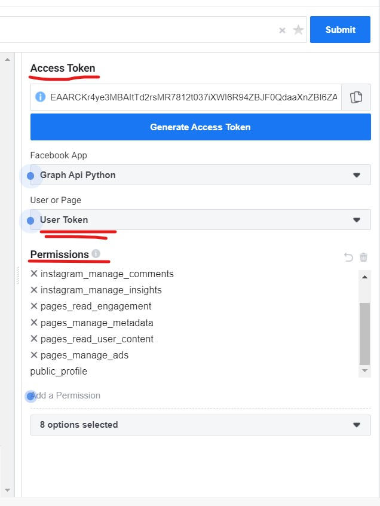
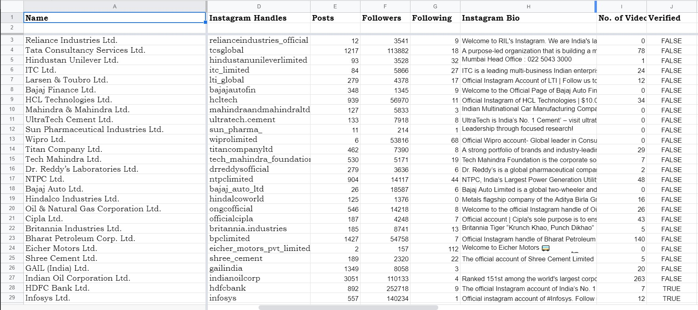
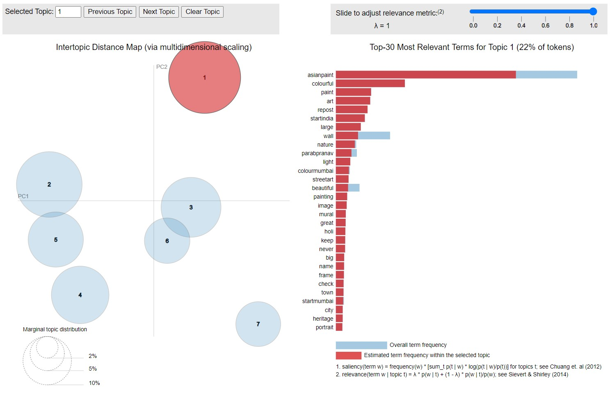

# IIM-Udaipur-NLP
This repository consists of my project on Natural Language Processing under Prof. Bhavya Singhvi, IIM Udaipur.

The project aimed at "Understanding Public Corporate Disclosures on Instagram" using Latent Dirichlet Allocation ( part of Natural Language Processing ).

Used Instagram Graph API ( it's free to use once you register as a Facebook developer on their website) with the following permissions.

Collected the following data from the home-page of NIFTY50 firms' Instagram page.

Looks neat when viewed as JSON file.

Upon applying LDA using NLTK and gensim in Python, optimal number of topics were utilized to generate sensible output.
Here is the output for Asian Paints:

